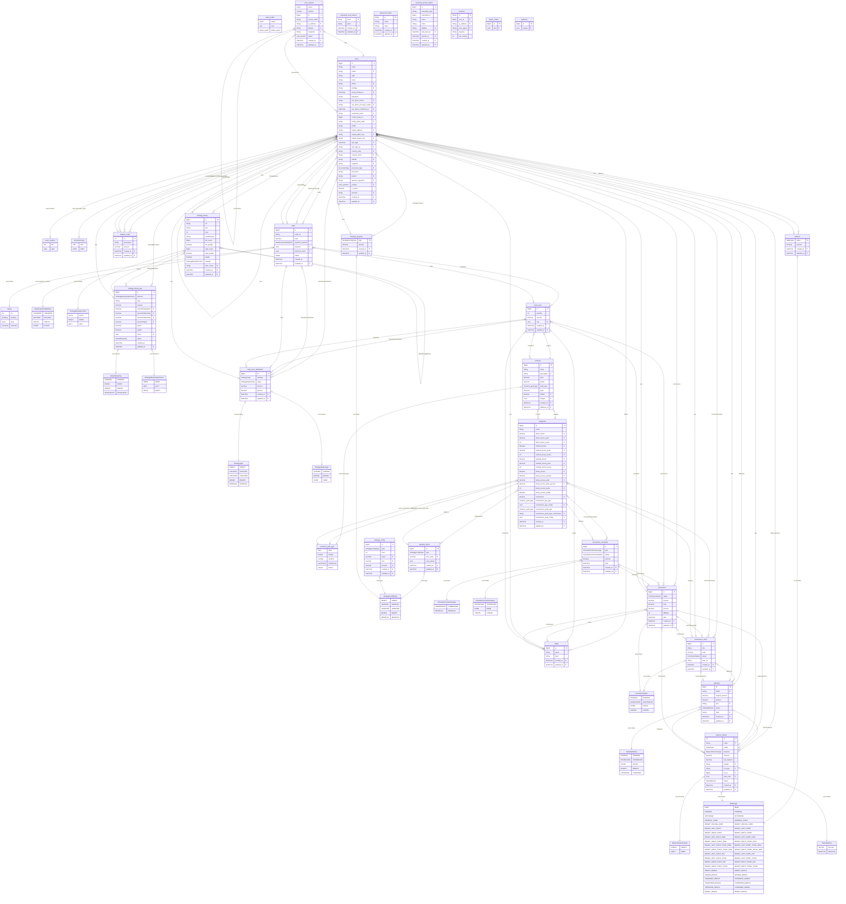

```mermaid
erDiagram

        StatusBalance {
            ACTIVE ACTIVE
INACTIVE INACTIVE
        }
    


        StrategyConfigType {
            DIRECT DIRECT
UNILEVEL UNILEVEL
UNILEVER UNILEVER
BINARY BINARY
RESIDUAL RESIDUAL
        }
    


        SchedulerCommisionType {
            COMMISSION COMMISSION
RESIDUAL RESIDUAL
        }
    


        SchedulerCommisionStatus {
            SCHEDULER SCHEDULER
DONE DONE
CANCEL CANCEL
        }
    


        CommisionStatus {
            PENDING PENDING
ASSOCIATED ASSOCIATED
PAYED PAYED
CANCEL CANCEL
        }
    


        products_yield_type {
            diary diary
weekly weekly
monthly monthly
semiannual semiannual
annual annual
        }
    


        users_profile {
            admin admin
user user
admin_watch admin_watch
        }
    


        users_position {
            left left
right right
        }
    


        user_session {
            active active
inactive inactive
        }
    


        Status {
            init init
pending pending
done done
canceled canceled
        }
    


        StrategyType {
            DIRECT DIRECT
UNILEVEL UNILEVEL
UNILEVER UNILEVER
BINARY BINARY
RESIDUAL RESIDUAL
        }
    


        StrategyStatusType {
            QUEUED QUEUED
ERROR ERROR
DONE DONE
        }
    


        WalletType {
            MAIN MAIN
PENDING PENDING
WITHDRAW WITHDRAW
GENERAL_POINT GENERAL_POINT
BINARY_CEILING_USER BINARY_CEILING_USER
BINARY_LEFT_POINT BINARY_LEFT_POINT
BINARY_RIGHT_POINT BINARY_RIGHT_POINT
BINARY_LEFT_POINT_NEW BINARY_LEFT_POINT_NEW
BINARY_RIGHT_POINT_NEW BINARY_RIGHT_POINT_NEW
BINARY_LEFT_POINT_TOTAL_NEW BINARY_LEFT_POINT_TOTAL_NEW
BINARY_RIGHT_POINT_TOTAL_NEW BINARY_RIGHT_POINT_TOTAL_NEW
BINARY_LEFT_POINT_PAY BINARY_LEFT_POINT_PAY
BINARY_LEFT_POINT_TOTAL BINARY_LEFT_POINT_TOTAL
BINARY_RIGHT_POINT_PAY BINARY_RIGHT_POINT_PAY
BINARY_RIGHT_POINT_TOTAL BINARY_RIGHT_POINT_TOTAL
DIRECT_BONUS DIRECT_BONUS
WINWIN_BONUS WINWIN_BONUS
TOKENWAY_BONUS TOKENWAY_BONUS
TOKENTEEN_BONUS TOKENTEEN_BONUS
TOKENONE_BONUS TOKENONE_BONUS
BINARY_BONUS BINARY_BONUS
        }
    


        BalanceDirectionType {
            CREDIT CREDIT
DEBIT DEBIT
        }
    


        StatusBinaryPay {
            PENDING PENDING
PAYED PAYED
ERROR ERROR
NOTQUALIFY NOTQUALIFY
        }
    


        StatusWithdraw {
            PENDING PENDING
SCHEDULER SCHEDULER
PAYED PAYED
REJECT REJECT
CANCELED CANCELED
        }
    


        OrderPaymentmMethod {
            UNKNOWN UNKNOWN
BALANCE BALANCE
CRIPTO CRIPTO
PLISIO PLISIO
        }
    


        StrategyBinaryPayDirection {
            NONE NONE
LEFT LEFT
RIGHT RIGHT
        }
    


        StrategyBinaryDirection {
            AUTO AUTO
RIGHT RIGHT
LEFT LEFT
        }
    


        DocumentType {
            CPF CPF
CNPJ CNPJ
        }
    
  "users" {
    BigInt id "🗝️"
    String name 
    String avatar "❓"
    String login 
    String email 
    String phone "❓"
    String birthday "❓"
    DateTime email_verified_at "❓"
    String password 
    String two_factor_secret "❓"
    String two_factor_recovery_codes "❓"
    DateTime two_factor_confirmed_at "❓"
    String remember_token "❓"
    BigInt current_team_id "❓"
    String profile_photo_path "❓"
    String profile 
    String bep20_address "❓"
    String bep20_public_key "❓"
    String bep20_private_key "❓"
    DateTime last_login "❓"
    String last_login_ip "❓"
    String country_code "❓"
    String country_name "❓"
    String latitude "❓"
    String longitude "❓"
    DocumentType document_type "❓"
    String document "❓"
    String gender "❓"
    String sponsor_migration "❓"
    users_position position "❓"
    Boolean is_active 
    String ancestry "❓"
    DateTime created_at "❓"
    DateTime updated_at "❓"
    }
  

  "balance" {
    WalletType wallet "🗝️"
    Decimal amount 
    DateTime created_at "❓"
    DateTime updated_at "❓"
    }
  

  "balance_history" {
    Int id "🗝️"
    String name "❓"
    WalletType wallet 
    BalanceDirectionType direction 
    Decimal amount 
    Decimal last_balance 
    String identify "❓"
    String ref_type "❓"
    BigInt ref_id "❓"
    Json extra_info "❓"
    StatusBalance status 
    DateTime created_at "❓"
    DateTime updated_at "❓"
    }
  

  "balance_order" {
    Int id "🗝️"
    String description 
    Decimal amount 
    DateTime created_at "❓"
    DateTime updated_at "❓"
    }
  

  "password_reset_tokens" {
    String email "🗝️"
    String token 
    DateTime created_at "❓"
    DateTime updated_at "❓"
    }
  

  "password_resets" {
    BigInt id "🗝️"
    String email 
    String token 
    DateTime created_at "❓"
    DateTime updated_at "❓"
    }
  

  "personal_access_tokens" {
    BigInt id "🗝️"
    String tokenable_type 
    BigInt tokenable_id 
    String name 
    String token 
    String abilities "❓"
    DateTime last_used_at "❓"
    DateTime expires_at "❓"
    DateTime created_at "❓"
    DateTime updated_at "❓"
    }
  

  "products" {
    BigInt id "🗝️"
    String name 
    String description "❓"
    Decimal price 
    Decimal points 
    products_yield_type yield_type 
    Decimal yield 
    Boolean hidden "❓"
    Json images "❓"
    DateTime created_at "❓"
    DateTime updated_at "❓"
    }
  

  "wallet" {
    BigInt id "🗝️"
    String name 
    String hash 
    DateTime created_at "❓"
    DateTime updated_at "❓"
    }
  

  "categories" {
    BigInt id "🗝️"
    String name 
    Boolean direct_bonus "❓"
    Decimal direct_bonus_yield "❓"
    Int direct_bonus_levels "❓"
    Boolean unilevel_bonus "❓"
    Decimal unilevel_bonus_yield "❓"
    Int unilevel_bonus_levels "❓"
    Boolean residual_bonus "❓"
    Decimal residual_bonus_yield "❓"
    Int residual_bonus_levels "❓"
    Boolean binary_bonus "❓"
    Boolean binary_bonus_position "❓"
    Decimal binary_bonus_yield "❓"
    Decimal binary_bonus_point_percent "❓"
    Int binary_bonus_levels "❓"
    Boolean binary_bonus_qualify 
    Boolean commission "❓"
    products_yield_type commission_pay_type 
    Json commission_pay_config "❓"
    products_yield_type commission_yield_type 
    String commission_yield_type_commission "❓"
    Json commission_yield_config "❓"
    DateTime created_at "❓"
    DateTime updated_at "❓"
    }
  

  "category_items" {
    BigInt id "🗝️"
    StrategyConfigType type 
    Decimal max_value "❓"
    Json level_values 
    DateTime created_at "❓"
    DateTime updated_at "❓"
    }
  

  "user_session" {
    BigInt id "🗝️"
    String access_token 
    String ip_address "❓"
    String latitude "❓"
    String longitude "❓"
    user_session status 
    DateTime created_at "❓"
    DateTime updated_at "❓"
    }
  

  "sessions" {
    String id "🗝️"
    BigInt user_id "❓"
    String ip_address "❓"
    String user_agent "❓"
    String payload 
    Int last_activity 
    }
  

  "strategy_binary" {
    BigInt id "🗝️"
    String ref 
    String hier 
    Int level 
    String autoDirection 
    BigInt left_count 
    Boolean left_qualify 
    BigInt right_count 
    Boolean right_qualify 
    Boolean qualify 
    StrategyBinaryDirection strategy 
    String date_check "❓"
    DateTime created_at "❓"
    DateTime updated_at "❓"
    }
  

  "strategy_binary_pay" {
    BigInt id "🗝️"
    StrategyBinaryPayDirection direction 
    String date 
    Decimal amount 
    Decimal amountCeilingUser "❓"
    Decimal percentTotalCeiling "❓"
    Decimal amountTotalCeiling "❓"
    Decimal amountPayed "❓"
    Decimal points 
    Boolean qualify 
    Json mirror "❓"
    StatusBinaryPay status 
    DateTime created_at 
    DateTime updated_at "❓"
    }
  

  "strategy_config" {
    BigInt id "🗝️"
    StrategyConfigType type 
    Int level 
    Decimal value "❓"
    Decimal limit "❓"
    Decimal percent "❓"
    DateTime created_at "❓"
    DateTime updated_at "❓"
    }
  

  "strategy_progress" {
    StrategyConfigType type "🗝️"
    Decimal amount 
    DateTime created_at "❓"
    DateTime updated_at "❓"
    }
  

  "order" {
    BigInt id "🗝️"
    String order_id 
    Decimal total 
    OrderPaymentmMethod payment_method 
    Json payment "❓"
    Json payment_result "❓"
    Status status 
    DateTime created_at 
    DateTime updated_at "❓"
    }
  

  "order_item" {
    BigInt id "🗝️"
    Int quantity 
    Decimal amount 
    Json info "❓"
    DateTime created_at 
    DateTime updated_at "❓"
    }
  

  "order_item_distribution" {
    BigInt id "🗝️"
    StrategyType strategy 
    StrategyStatusType status 
    Decimal amount 
    Decimal percent 
    DateTime created_at "❓"
    DateTime updated_at "❓"
    }
  

  "commission_order" {
    BigInt id "🗝️"
    String obs 
    Decimal total 
    CommisionStatus status 
    String date_ref 
    DateTime created_at "❓"
    DateTime updated_at "❓"
    }
  

  "withdraw" {
    BigInt id "🗝️"
    String wallet "❓"
    Decimal original_amount 
    Decimal amount 
    String obs "❓"
    StatusWithdraw status 
    String hash "❓"
    DateTime created_at "❓"
    DateTime updated_at "❓"
    }
  

  "commission" {
    BigInt id "🗝️"
    CommisionStatus status 
    Decimal amount 
    Decimal total 
    Decimal percent 
    Int diffDays 
    DateTime date 
    DateTime created_at "❓"
    DateTime updated_at "❓"
    }
  

  "commission_scheduler" {
    BigInt id "🗝️"
    SchedulerCommisionType type 
    SchedulerCommisionStatus status 
    Decimal amount 
    DateTime date 
    DateTime created_at "❓"
    DateTime updated_at "❓"
    }
  

  "import_orders" {
    BigInt id "🗝️"
    Json info "❓"
    }
  

  "webhook" {
    BigInt id "🗝️"
    Json request "❓"
    }
  
    "users" o|--|o "DocumentType" : "enum:document_type"
    "users" o|--|o "users" : "sponsor"
    "users" o|--|o "users_position" : "enum:position"
    "users" o|--|o "users" : "users_users_binary_parent_idTousers"
    "users" o{--}o "users" : "other_users_users_binary_parent_idTousers"
    "users" o|--|o "users" : "users_users_sponsor_idTousers"
    "users" o{--}o "users" : "other_users_users_sponsor_idTousers"
    "users" o{--}o "users" : "User"
    "users" o{--}o "strategy_binary" : "StrategyBinary"
    "users" o{--}o "user_session" : "UserSession"
    "users" o{--}o "order" : "Order"
    "users" o{--}o "order_item_distribution" : "OrderItemDistribution"
    "users" o{--}o "strategy_progress" : "StrategyProgress"
    "users" o{--}o "balance" : "Balance"
    "users" o{--}o "balance_history" : "BalanceHistory"
    "users" o{--}o "strategy_binary_pay" : "StrategyBinaryPay"
    "users" o{--}o "commission" : "Commission"
    "users" o{--}o "wallet" : "Wallet"
    "users" o{--}o "commission_order" : "CommissionOrder"
    "users" o{--}o "withdraw" : "Withdraw"
    "users" o{--}o "balance_order" : "BalanceOrder"
    "users" o{--}o "balance_order" : "BalanceOrderReleasedBy"
    "users" o{--}o "order" : "OrderPaymentoBy"
    "balance" o|--|| "users" : "user"
    "balance" o|--|| "WalletType" : "enum:wallet"
    "balance_history" o|--|| "users" : "user"
    "balance_history" o|--|| "WalletType" : "enum:wallet"
    "balance_history" o|--|| "BalanceDirectionType" : "enum:direction"
    "balance_history" o|--|| "StatusBalance" : "enum:status"
    "balance_history" o{--}o "commission" : "Commission"
    "balance_history" o{--}o "withdraw" : "Withdraw"
    "balance_order" o|--|| "users" : "user"
    "balance_order" o|--|| "users" : "releasedBy"
    "products" o|--|| "products_yield_type" : "enum:yield_type"
    "products" o|--|o "categories" : "category"
    "products" o{--}o "order_item" : "OrderItem"
    "wallet" o|--|| "users" : "user"
    "wallet" o{--}o "order_item" : "OrderItem"
    "wallet" o{--}o "commission" : "Commission"
    "categories" o|--|| "products_yield_type" : "enum:commission_pay_type"
    "categories" o|--|| "products_yield_type" : "enum:commission_yield_type"
    "categories" o{--}o "category_items" : "CategoryItem"
    "categories" o{--}o "products" : "Product"
    "categories" o{--}o "commission_scheduler" : "CommissionScheduler"
    "categories" o{--}o "commission_order" : "CommissionOrder"
    "category_items" o|--|| "StrategyConfigType" : "enum:type"
    "category_items" o|--|| "categories" : "category"
    "user_session" o|--|o "users" : "user"
    "user_session" o|--|| "user_session" : "enum:status"
    "strategy_binary" o|--|o "users" : "user"
    "strategy_binary" o|--|o "strategy_binary" : "parent"
    "strategy_binary" o|--|o "strategy_binary" : "left"
    "strategy_binary" o|--|o "strategy_binary" : "right"
    "strategy_binary" o|--|| "StrategyBinaryDirection" : "enum:strategy"
    "strategy_binary" o{--}o "strategy_binary" : "ParentStrategyBinary"
    "strategy_binary" o{--}o "strategy_binary" : "LeftStrategyBinary"
    "strategy_binary" o{--}o "strategy_binary" : "RightStrategyBinary"
    "strategy_binary" o{--}o "strategy_binary_pay" : "StrategyBinaryPay"
    "strategy_binary_pay" o|--|| "StrategyBinaryPayDirection" : "enum:direction"
    "strategy_binary_pay" o|--|| "strategy_binary" : "binary"
    "strategy_binary_pay" o|--|| "users" : "user"
    "strategy_binary_pay" o|--|| "StatusBinaryPay" : "enum:status"
    "strategy_config" o|--|| "StrategyConfigType" : "enum:type"
    "strategy_progress" o|--|| "StrategyConfigType" : "enum:type"
    "strategy_progress" o|--|| "users" : "user"
    "order" o|--|| "users" : "user"
    "order" o|--|| "OrderPaymentmMethod" : "enum:payment_method"
    "order" o|--|o "users" : "paymentBy"
    "order" o|--|| "Status" : "enum:status"
    "order" o{--}o "order_item" : "OrderItem"
    "order" o{--}o "order_item_distribution" : "OrderItemDistribution"
    "order_item" o|--|| "order" : "order"
    "order_item" o|--|| "products" : "product"
    "order_item" o|--|o "wallet" : "wallet"
    "order_item" o{--}o "order_item_distribution" : "OrderItemDistribution"
    "order_item" o{--}o "commission" : "Commission"
    "order_item_distribution" o|--|| "StrategyType" : "enum:strategy"
    "order_item_distribution" o|--|| "StrategyStatusType" : "enum:status"
    "order_item_distribution" o|--|| "order" : "order"
    "order_item_distribution" o|--|| "order_item" : "orderItem"
    "order_item_distribution" o|--|| "users" : "user"
    "commission_order" o|--|| "users" : "user"
    "commission_order" o|--|| "CommisionStatus" : "enum:status"
    "commission_order" o|--|| "categories" : "category"
    "commission_order" o{--}o "commission" : "Commission"
    "commission_order" o{--}o "withdraw" : "Withdraw"
    "withdraw" o|--|| "users" : "user"
    "withdraw" o|--|| "StatusWithdraw" : "enum:status"
    "withdraw" o|--|o "balance_history" : "balanceHistory"
    "withdraw" o|--|o "commission_order" : "commissionOrder"
    "commission" o|--|o "commission_order" : "commissionOrder"
    "commission" o|--|| "commission_scheduler" : "scheduler"
    "commission" o|--|| "users" : "user"
    "commission" o|--|| "order_item" : "orderItem"
    "commission" o|--|o "wallet" : "wallet"
    "commission" o|--|| "CommisionStatus" : "enum:status"
    "commission" o|--|o "balance_history" : "balanceHistory"
    "commission_scheduler" o|--|| "SchedulerCommisionType" : "enum:type"
    "commission_scheduler" o|--|| "categories" : "category"
    "commission_scheduler" o|--|| "SchedulerCommisionStatus" : "enum:status"
    "commission_scheduler" o{--}o "commission" : "Commission"
```
